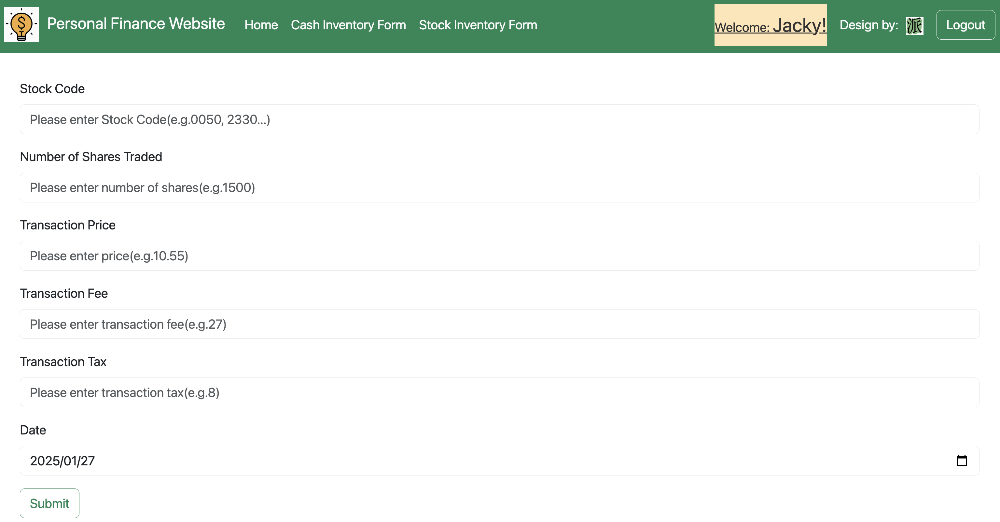

:moneybag: 個人理財網站
===

[前往網站](https://personal-finance-website.onrender.com/)
--

介紹
---
This website is designed to display the user's inventory of Taiwanese currency, US dollars, and Taiwanese stocks. The stock information reflects the latest closing prices from the Taiwan Stock Exchange on the current trading day.

    Note:
    Since the free version of Render is being used, the server automatically enters a dormant state 
    after 15 minutes of inactivity. As a result, there may be a delay in loading the screen.        
    We appreciate your understanding.

技術堆疊
---

* 後端:`Python3`
* 前端:`JavaScript`, `HTML`, `CSS`
* 框架: `Bootstrap`, `Flask`
* 資料庫:`MySQL`(Used `SQLite3` for testing)
* Cloud Services: `Google Cloud Platform(GCP)`, `Render`
* API:[Global Real-Time Exchange Rate API](https://tw.rter.info/howto_currencyapi.php)

使用者介面
---
    帳號:wang569
    密碼:12345 

    帳號:cindy0925
    密碼:flyaway

    帳號:angel54yun 
    密碼:25896
    
    備註:
    由於使用Render的免費方案，伺服器在15分鐘無人使用後會自動休眠，因此首次喚醒時可能會有頁面載入延遲，敬請見諒。
    
#### 首頁:

#### 現金存量頁面:

#### 股票存量頁面:

#### 現金紀錄頁面:

#### 股票紀錄頁面:

