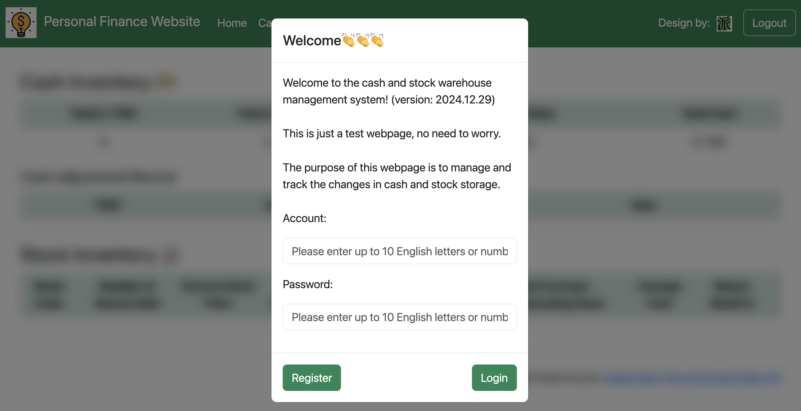
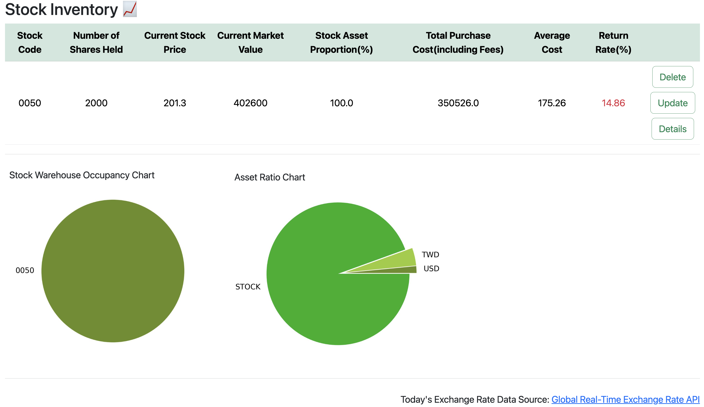

:moneybag: 個人理財網站
===

[前往網站](https://personal-finance-website.onrender.com/)
--

介紹
---
本網站用於顯示使用者持有的新台幣、美元與台灣股票之庫存情況。股票資訊以當日台灣證券交易所的最新收盤價為準。

    注意:
    由於使用Render的免費方案，伺服器在15分鐘無操作後會自動進入休眠，因此頁面載入可能會延遲。感謝您的體諒。

技術堆疊
---

* 後端:`Python3`
* 前端:`JavaScript`, `HTML`, `CSS`
* 框架: `Bootstrap`, `Flask`
* 資料庫:`MySQL`(Used `SQLite3` for testing)
* 雲端服務: `Google Cloud Platform(GCP)`, `Render`
* API:[Global Real-Time Exchange Rate API](https://tw.rter.info/howto_currencyapi.php)

使用者介面
---
    帳號:wang569
    密碼:12345 

    帳號:cindy0925
    密碼:flyaway

    帳號:angel54yun 
    密碼:25896
    
    備註:
    由於使用Render的免費方案，伺服器在15分鐘無人使用後會自動休眠，因此首次喚醒時可能會有頁面載入延遲，敬請見諒。
    
#### 首頁:

#### 現金存量頁面:

#### 股票存量頁面:

#### 現金紀錄頁面:

#### 股票紀錄頁面:

