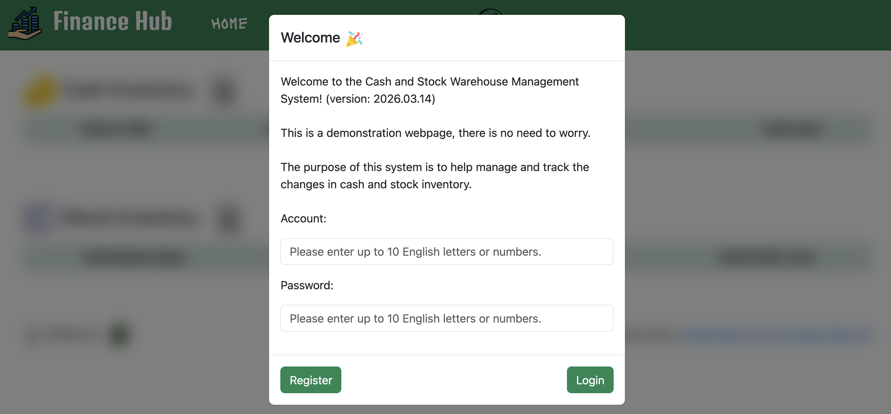
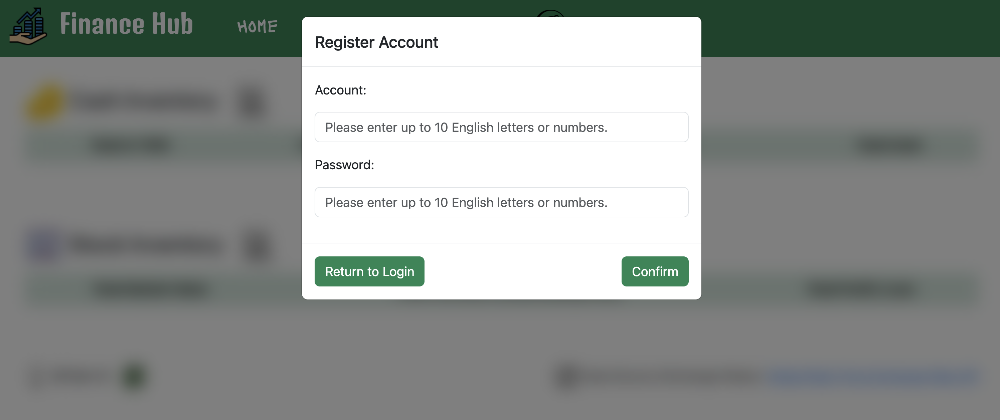
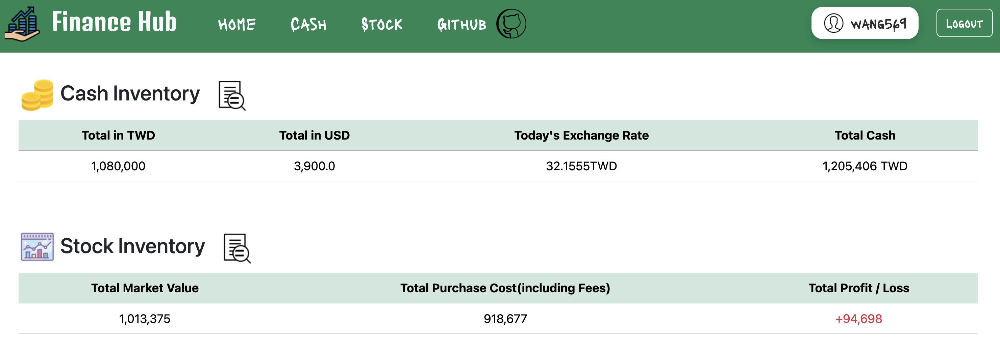
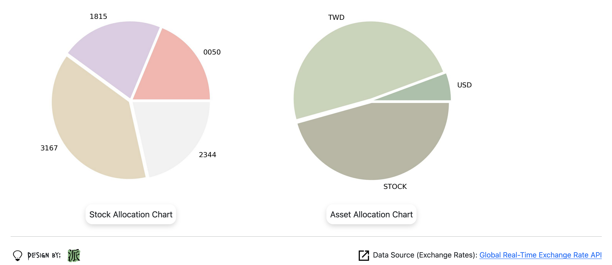
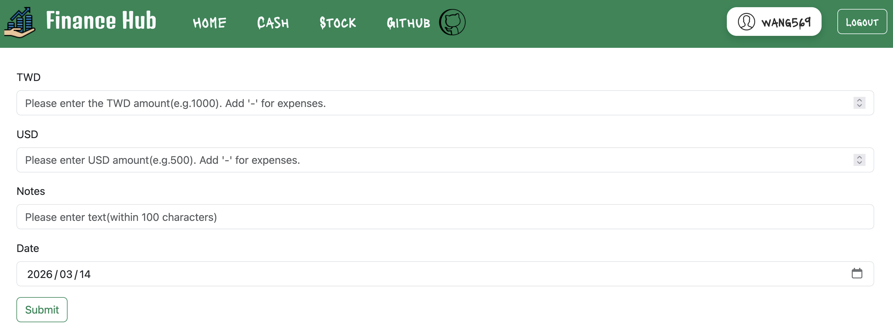
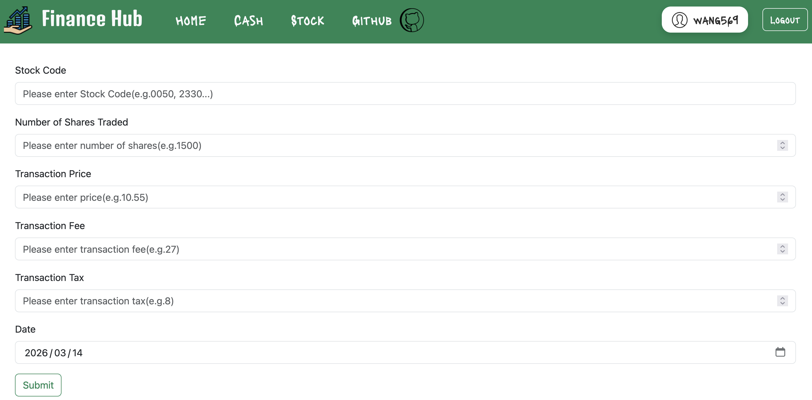
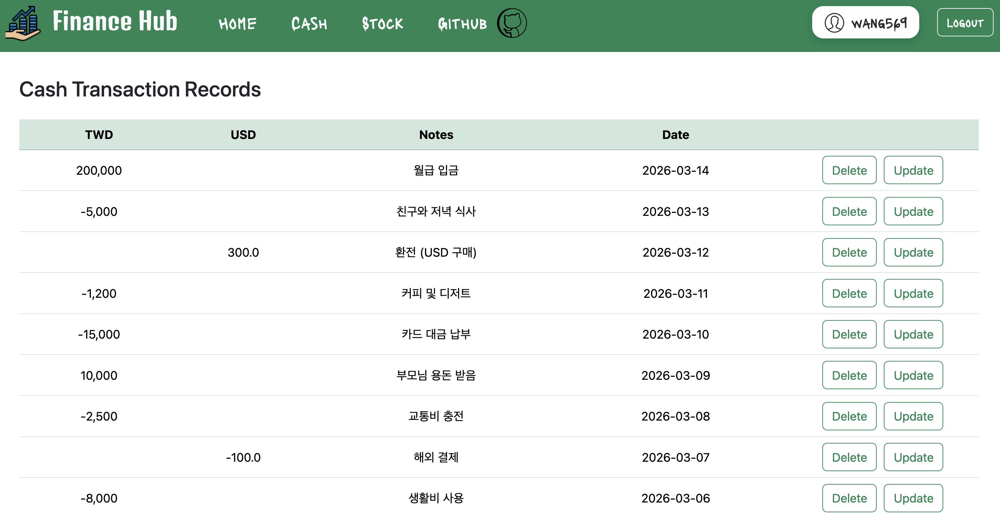
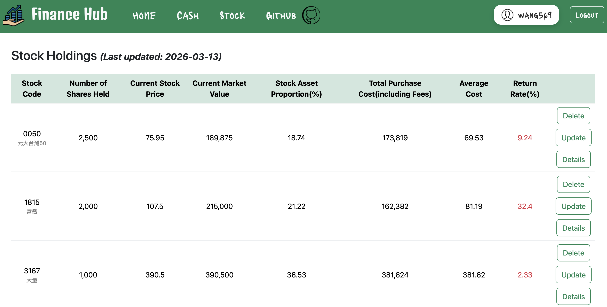

# :moneybag: Personal Finance Website

## [Go to Website](https://personal-finance-website.onrender.com/)

## Usage

This website is designed to display the user's inventory of Taiwanese currency, US dollars, and Taiwanese stocks. The stock information reflects the latest closing prices from the Taiwan Stock Exchange on the current trading day.

    Note:
    Since the free version of Render is being used, the server automatically enters a dormant state
    after 15 minutes of inactivity. As a result, there may be a delay in loading the screen.
    We appreciate your understanding.

## Technology Stack

- Backend:`Python3`
- Frontend:`JavaScript`, `HTML`, `CSS`
- Frameworks: `Bootstrap`, `Flask`
- Database:`MySQL`(Used `SQLite3` for testing)
- Cloud Services: `Google Cloud Platform(GCP)`, `Render`
- API:[Global Real-Time Exchange Rate API](https://tw.rter.info/howto_currencyapi.php)

## User Interface

    Account:wang569
    Password:12345

    Account:cindy0925
    Password:flyaway

    Account:amy54yun
    Password:25896

    Note:
    You can register a new account to try it out,
    or log in directly using the provided account and password.

#### Login Page:

#### Registration Page:

#### Home Page:

#### Cash Entry Page:

#### Stock Entry Page:

#### Cash Transaction Records:

#### Stock Holdings:

