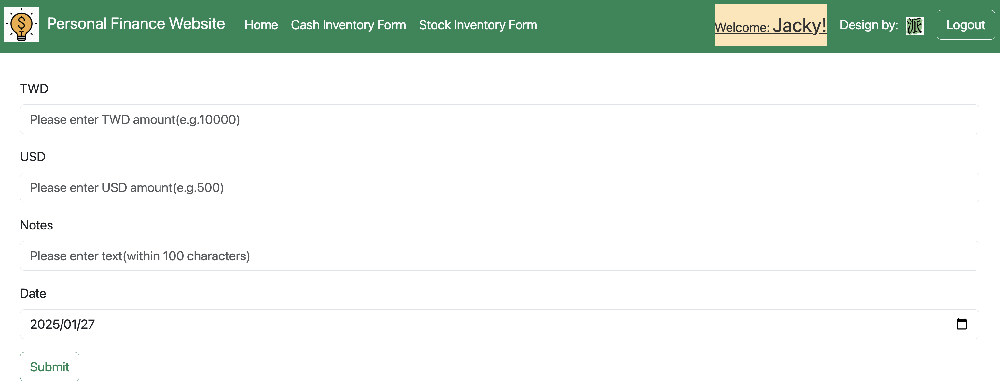

:moneybag: 개인 재무 웹사이트
===

[웹사이트 가기](https://personal-finance-website.onrender.com/)
--

소개
---
이 사이트는 사용자의 대만 달러·미국 달러 현금 보유량과 대만 주식 보유 현황을 표시하도록 설계되었습니다. 대만 주식 정보는 해당 거래일의 대만 증권거래소 최신 종가를 반영합니다.

    참고:
    무료 요금제로 Render 를 사용하고 있어,15분 동안 요청이 없으면 서버가 자동으로 절전 상태가 됩니다.그 결과 첫 화면 로딩이 지연될 수 있습니다. 
    양해 부탁드립니다.

기술 스텍
---

* 백엔드:`Python3`
* 프론트엔드:`JavaScript`, `HTML`, `CSS`
* 프레임워크: `Bootstrap`, `Flask`
* 데이터베이스:`MySQL`(Used `SQLite3` for testing)
* 클라우드 서비스: `Google Cloud Platform(GCP)`, `Render`
* API:[Global Real-Time Exchange Rate API](https://tw.rter.info/howto_currencyapi.php)

사용자 인터페이스
---
    아이디:wang569
    비밀번호:12345 

    아이디:cindy0925
    비밀번호:flyaway

    아이디:angel54yun 
    비밀번호:25896
    
    참고:
    새 계정을 등록해 직접 사용해 보시거나, 위의 계정과 비밀번호로 바로 로그인할 수 있습니다.
    
#### 홈 페이지:

#### 현금 보유 현황:

#### 주식 보유 현황:

#### 현금 기록:

#### 주식 기록:

