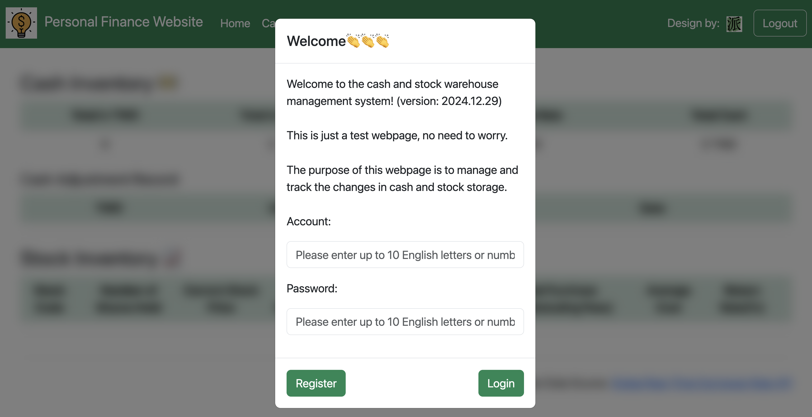
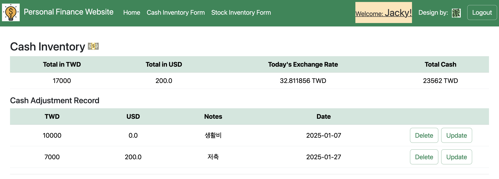
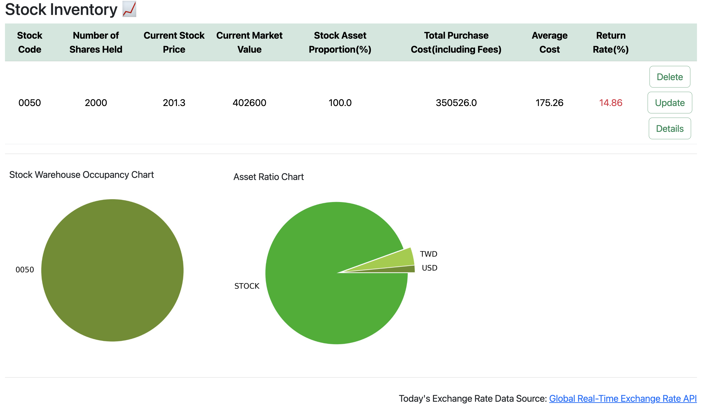
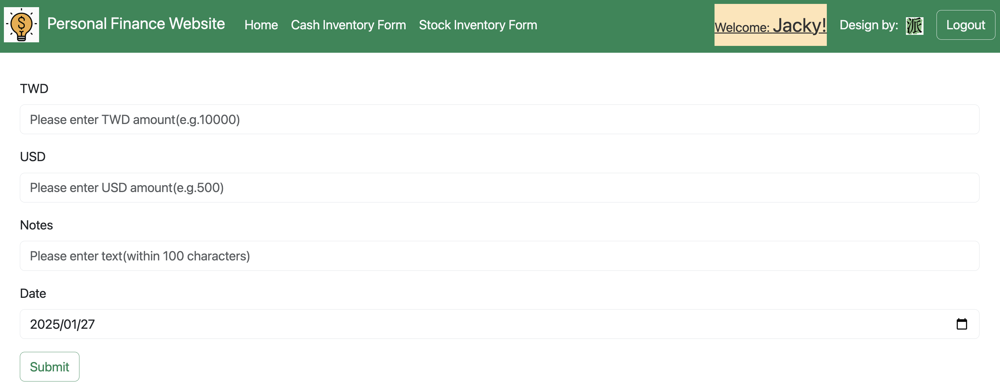
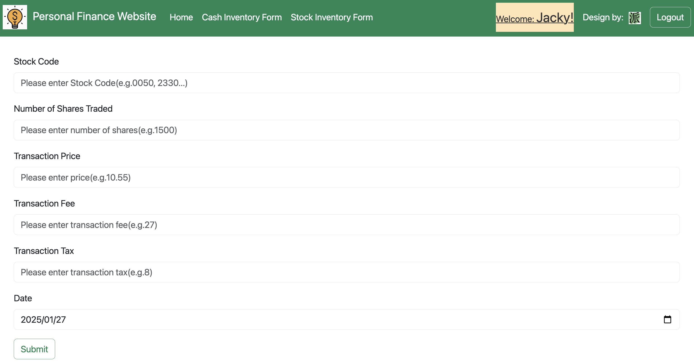

Personal Finance Website
===

[前往網站](https://personal-finance-website.onrender.com/)
--

用途
---
The purpose of this website is to manage and track the changes in cash and stock storage.

使用的程式語言
---

* 後端:Python3
* 前端:JavaScript, HTML
* 框架: Bootstrap, Flask
* 資料庫:MySQL
* 雲端服務: Google Cloud Platform(GCP), Render
* API:[Global Real-Time Exchange Rate API](https://tw.rter.info/howto_currencyapi.php)

使用者介面
---
    帳號:Jacky 
    密碼:12345 
    
    #您可以註冊一個新帳號體驗，
    或是直接使用此處提供的帳號及密碼登入。

* 首頁

* Cash Inventory

* Stock Inventory

* Cash Record

* Stock Record

